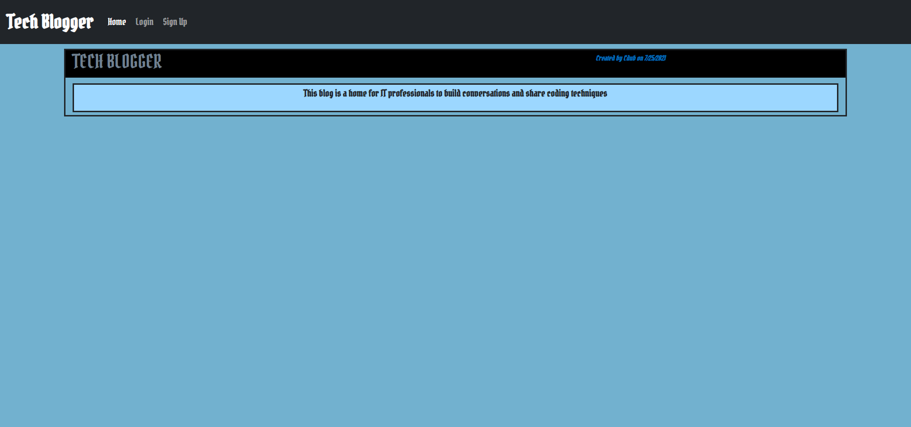

# Tech Blogger

## Contributers
* Chris Whalen, Github: **[CobaltFrostfish](https://github.com/CobaltFrostfish)**

## Links
* **[Repository](https://github.com/CobaltFrostfish/ecomm-server)**
* **[Live App](https://quiet-stream-77917.herokuapp.com/)**
# 

## The project
The Tech Blogger is an app for IT specialists, Dev's, and all other thech professionals to blog and chat about any and all things tech. Just simply create an account, sign in, and start blogging. Have helpful info for a fellow tech blogger? Well just leave a comment on their blog and help a brotha (or sista) out! What are you waiting for? give it a try!  

## Technologies applied
* JavaScript
* NodeJS
* Express
* MySQL
* JAWSDB
* Handlebars
* CSS
* MVC
* MyBrain

## The final production:
